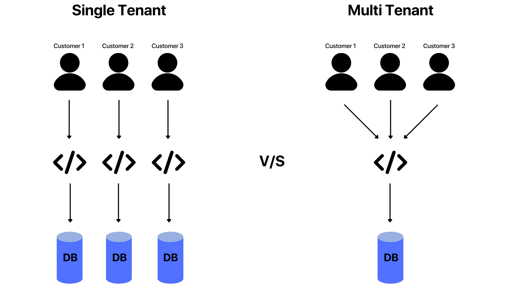

# Discover - Understand the concept of Multitenancy

> **IMPORTANT**: This section is for informational purposes only and does not require any actions to be taken by the participants. Its aim is to provide a better understanding of Multitenancy. The goal is to provide a clear understanding of the concepts and techniques involved, without the need for any hands-on implementation.

## What is Multitenancy

Multitenancy is an important architectural concept in cloud. In SAP BTP, we can develop and run multitenant applications, and share them with multiple customers simultaneously.
 - Multiple Customers can be served with a single instance of an application
 - Each customer using the application is called a tenant
 - All the tenants are using the same resources (resources are same physically, but provisioned for each tenant separately to maintain data privacy)
 - Even after sharing resources, customers won't be aware of each other as their data is kept totally separate

## Benefits of Multitenancy 
- Save Money - Multitenant architecture enables sharing of services, databases, resources, and applications. Hence a cloud vendor can offer their solution to many customers at a much lower cost than if each customer required their own dedicated infrastructure

- Pay As You Go - If a customer invests in their own infrastructure, they might reach capacity during times of high demand or sit idle during times of low demand. In multitenancy, resources are shared among customers. Hence as a customer, you can access extra capacity when you need it, and not pay for it when you don’t
- Easier Maintainability - Multitenancy reduces the need for individual customers to handle updates and maintenance. The vendor takes care of maintaining and updating the multitenant application, managing infrastructure, thus removing additional overhead from customers

In this session, we will build an end-to-end application in Business Application Studio, and deploy it to Cloud-Foundry as a multitenant app. 

We will then consume it from another subaccount within the same global account and experience how a multitenant app is built by the Provider and consumed by Tenants.

## Summary

The goal of this introduction was to give a clear understanding of the concepts involved in creating a Multitenant Application and why it is useful to build applications following this approach.

Continue to - [Exercise 1 -  Set Up a CAP Application](../ex1/README.md)