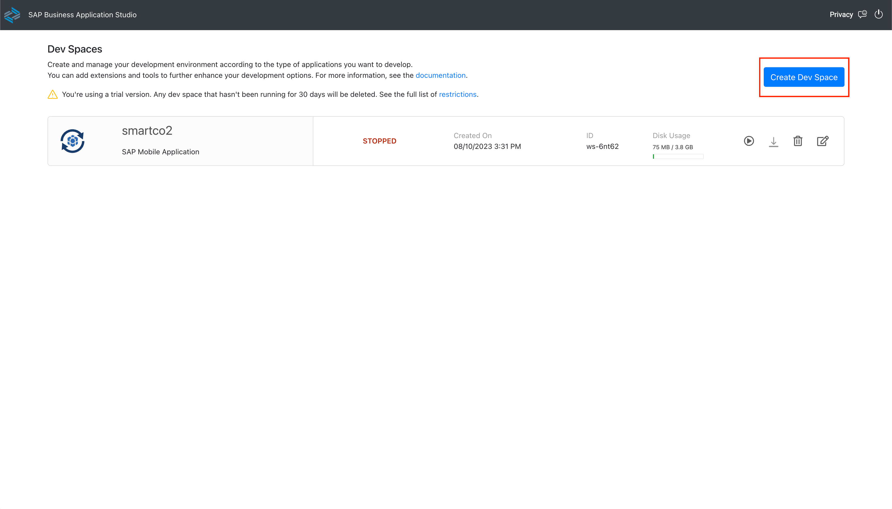
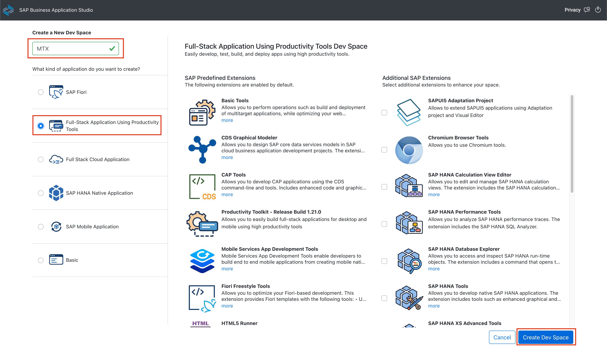
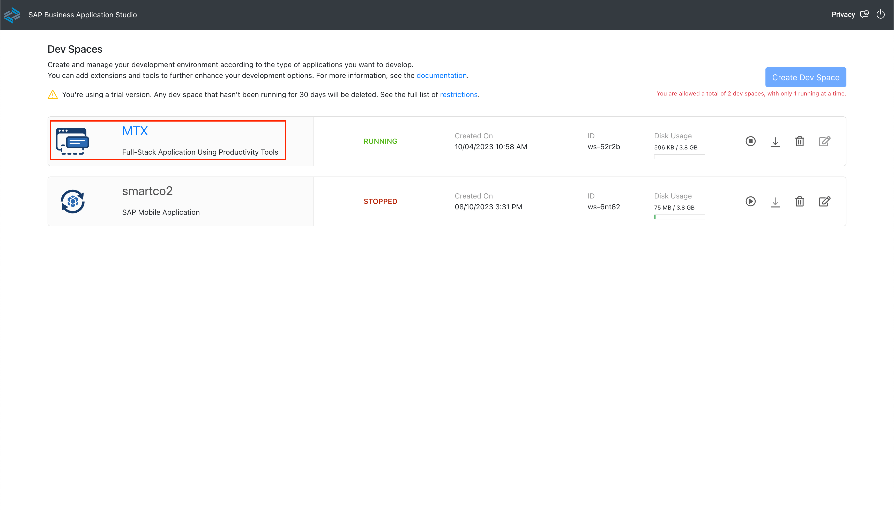
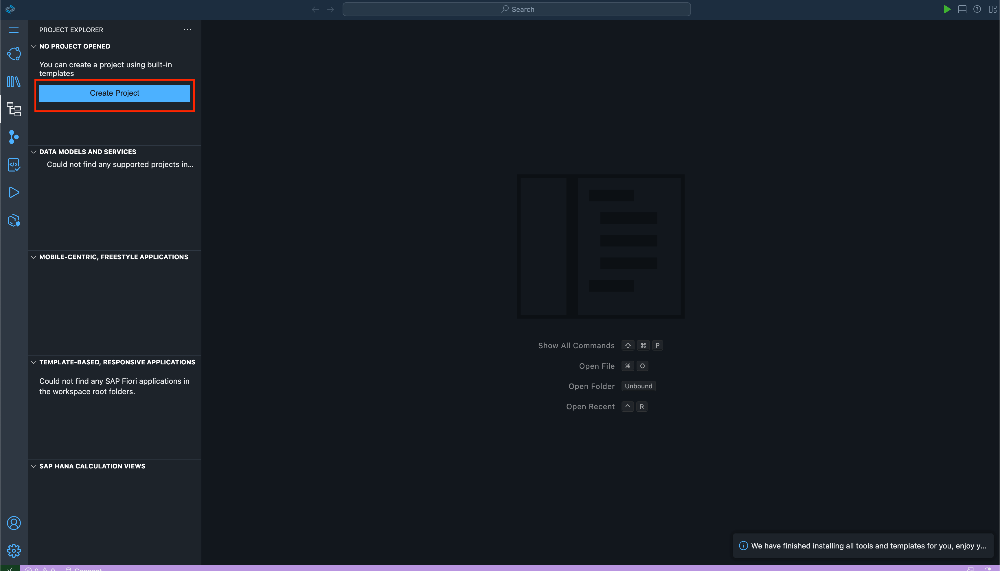
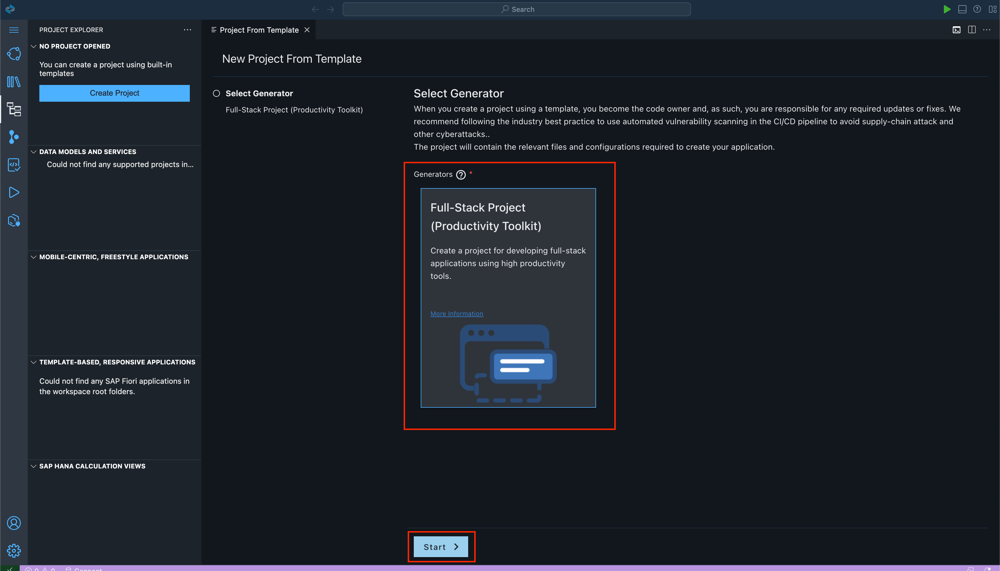
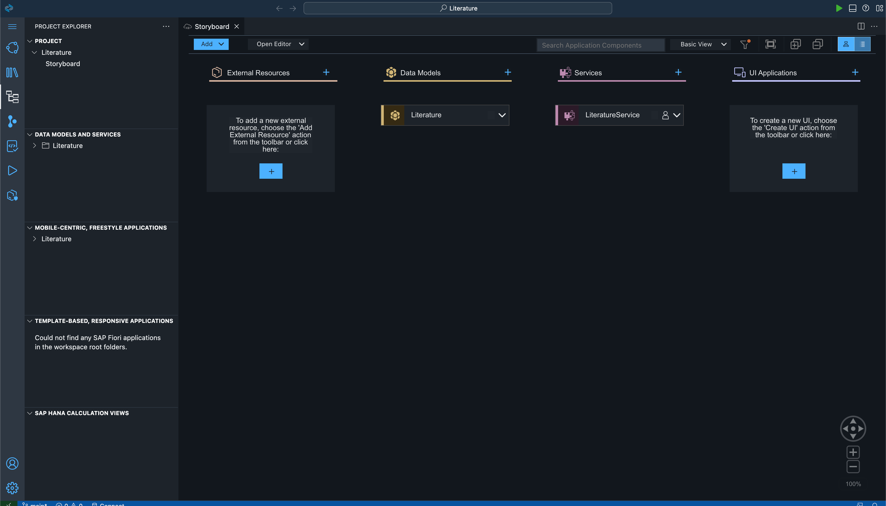

# Exercise 1 -  Set Up a CAP Application

## Create a Full Stack Cloud Application Dev Space on Business Application Studio

Go to Business Application Studio and follow the given steps -
 - Click on 'Create a Dev Space' to create a new dev space

    
 - Give a relevant name for your desired Dev Space, select the 'Full Stack Application Using Productivity Tools' option and click on 'Create Dev Space'.

    

## Set Up the CAP Application
- You will be greeted with the below screen. Click on the name of your Dev Space to open the Space.

    

- Click 'Create Project'

    

- Click on **'Full-Stack Project (Productivity Toolkit)'** and click Start

    

- Give your desired name to the app. We have named it 'Literature'. Press 'Finish'.

    

- You will be greeted with the below screen once the process is over. This is the Landing Page of the your project, called the **'Storyboard'**.

    

## Summary

You have now set up your CAP Application and are ready to begin creating your End-to-End CAP Application with Multitenancy.

Continue to - [Exercise 2 -  Define Data Models and Create Services](../ex2/README.md)