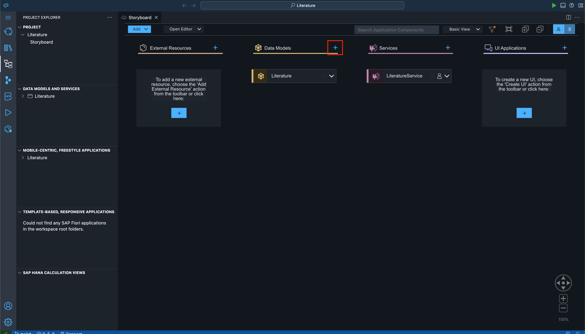
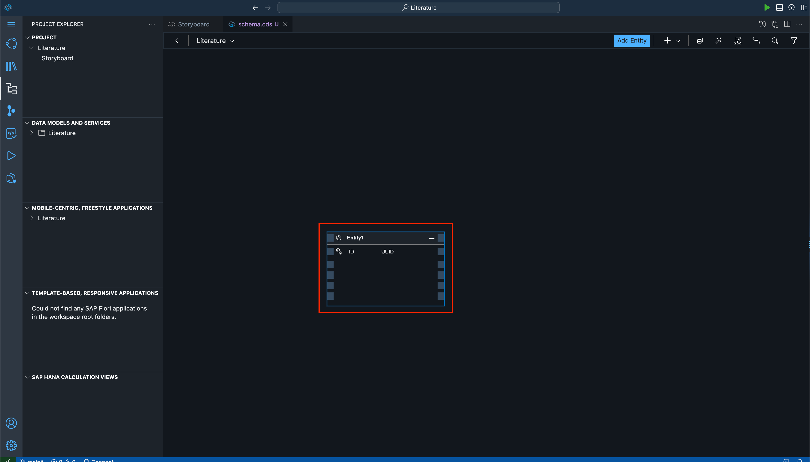
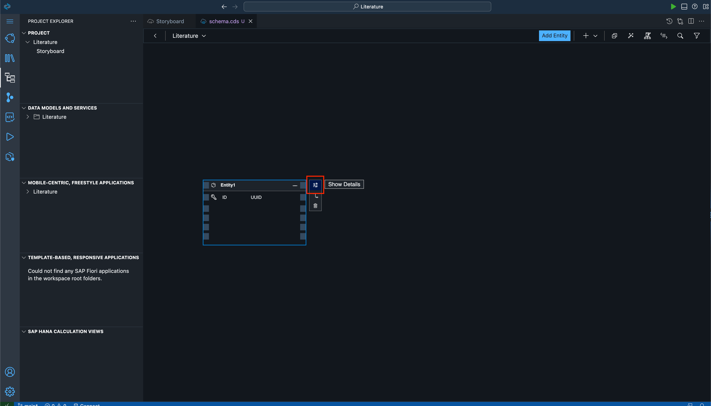
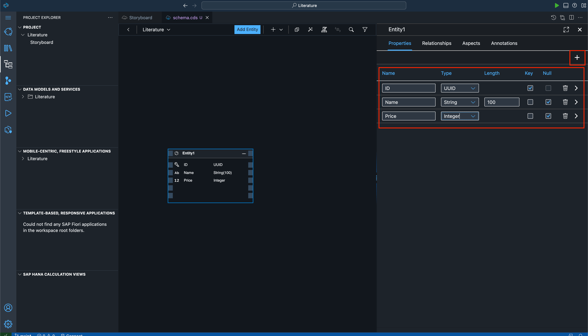
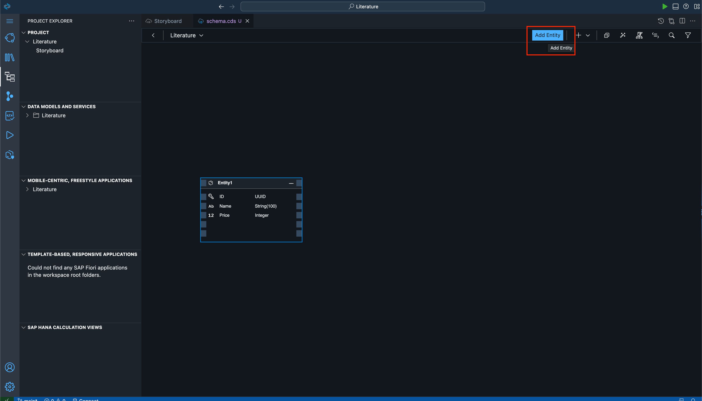
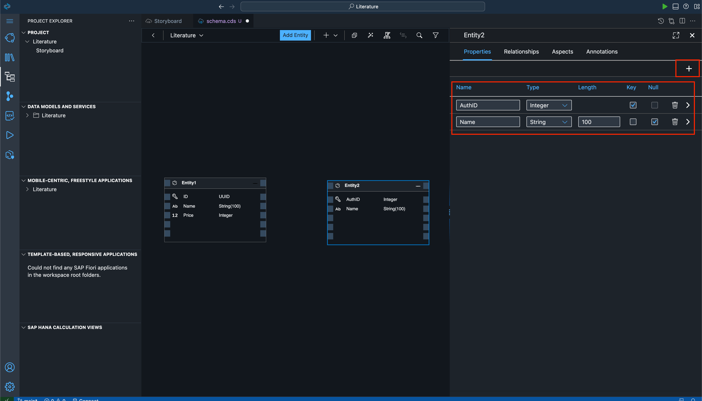
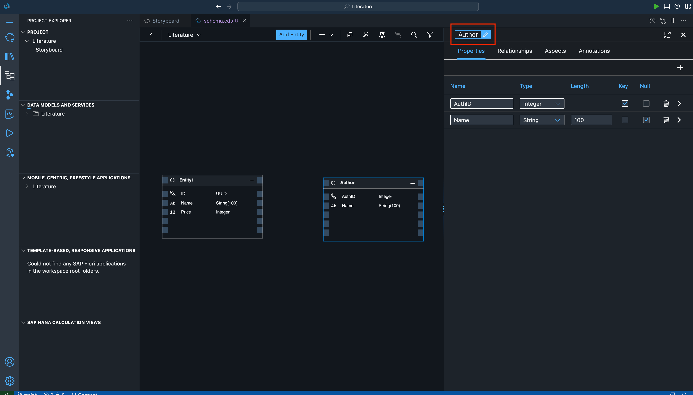
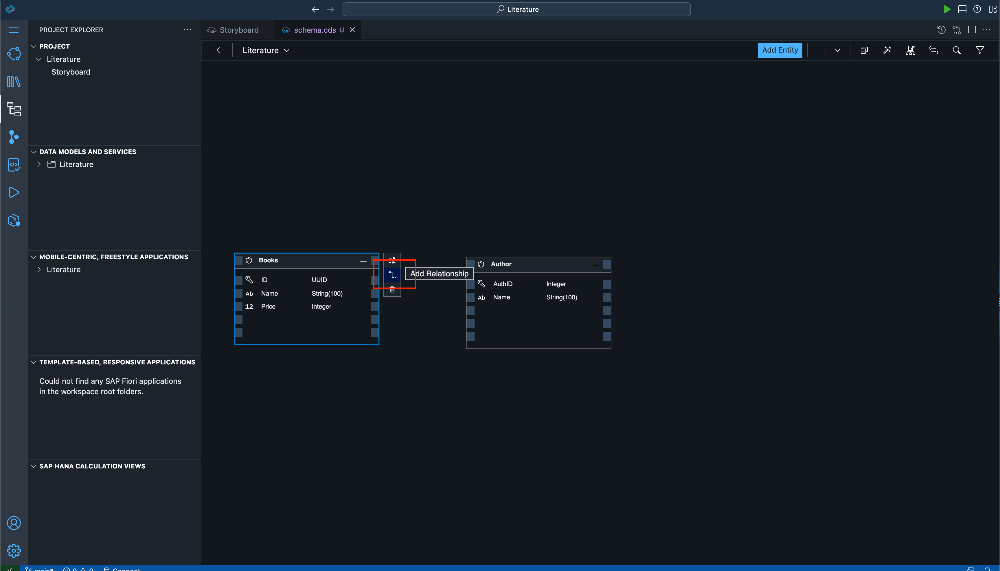
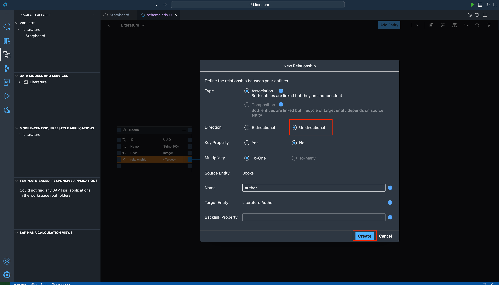
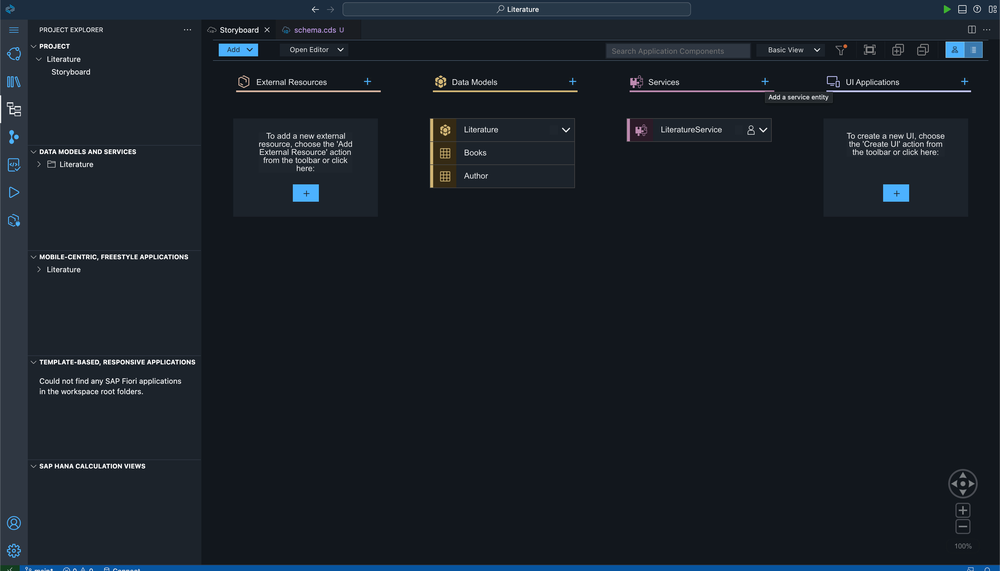

# Exercise 2 -  Define Data Models

## Define Data Model and Create Entities

Once you are done with the previous steps, you can move on towards creating entities. We will be creating 2 entities, one for Books and one for Author. 

You will be able to see the Storyboard Page. Click on the '+' symbol on the 'Data Models' Card in order to create the entities.

Now the 'Service Modeller' will open with the name 'schema.cds' on your screen. There will be a card that would have already loaded on your screen. This is your entity, and making changes to this would mean modifying the entity.

Click on the entity and click on the 'Show Details' icon as is shown in the screenshot. This will open the property screen where you can make modifications.

Click on '+' to add properties the way they have been shown in the screenshot.

Click on 'Add Entity' and another card will come up. Place it where you want on the screen, and open its configurations.

Use the '+' button again to add the properties as shown in the screenshot below.

Click on 'Entity2' and change the name to 'Author'. Do the same for 'Entity1' and rename it to 'Books'

Click on 'Books' entity and click on the 'Add Relationship' icon to add a relationship between the two entities.

This will open a dialog box. Make sure your selections match what is shown in the screenshot below. Make sure to change the 'Direction' to 'Unidirectional' from 'Bidirectional'. That would mostly be the only change you will have to make. Keep the 'Name' as 'author'. Select 'Create'.

As simply as this, you have created your entities. You can now go back to the 'Storyboard' page to see the changes on that page. It will look somewhat like how the below screenshot looks.

As you can see here, we have created 2 entities, Books and Author. The Books entity has a To-One Relationship with the Author entity. This would basically mean that each Book could have only one Author, but one Author could have written many Books.

## Summary

You have created the entities required for your application. We will now be creating a service for the same.

Continue to - [Exercise 3 - Create Service for App](../ex3/README.md)