# Exercise 3 - Create Services and Sample Data
## Define the Services for the Defined Entities

### Define Service
We will now project the services for the Entities we previously defined so that our UI is able to access the data we have defined with the Entities.

You will be able to see the Storyboard Page. Click on the '+' symbol on the 'Services' Card in order to create the service.

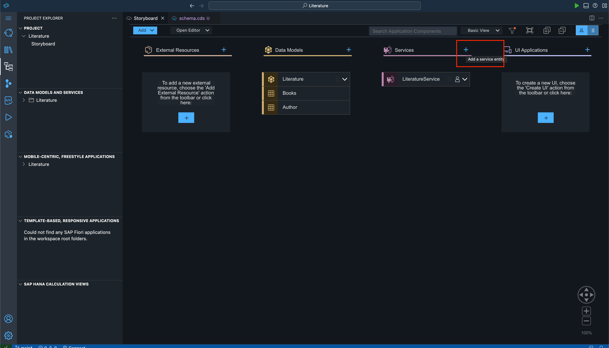

This will open the 'service.cds' tab and here you can create your service. Click on 'Books' and click 'OK'. This will create the entity card for 'Books'.

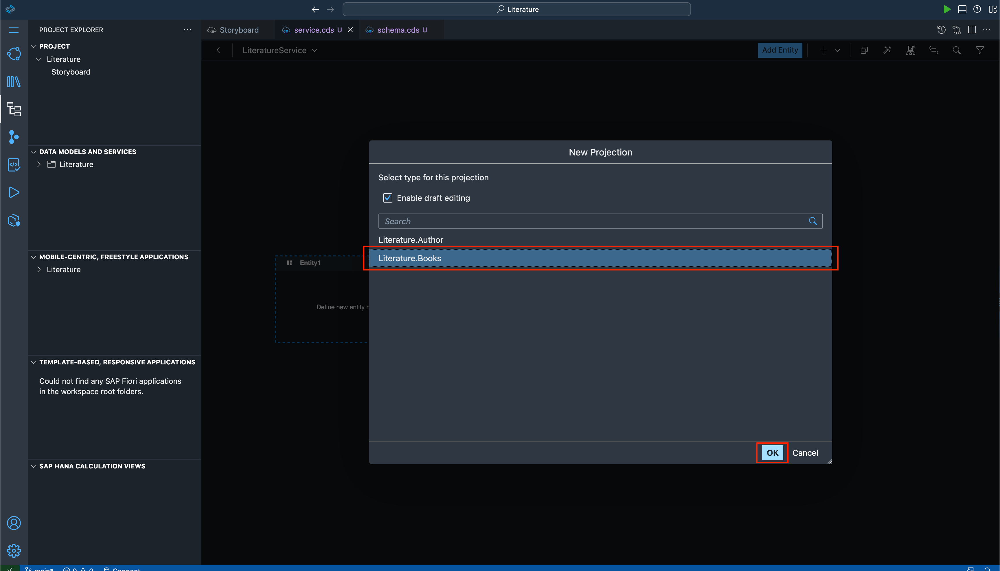

Click on 'Add Entity' again for 'Authors'. Click on 'Authors' and click 'OK'. This will create your whole service that you will be able to expose to get your app running.

Now when you go back to the 'Storyboard' page, you will be able to see the 'Services' card filled too. 

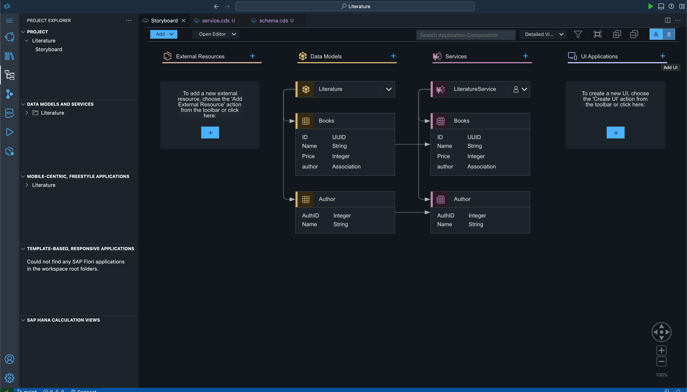

### Add Sample Data

Now we will add 'Sample Data' so that we have some data on the app to play with. Here you have to click on the 'Open Editor' dropdown and click on the 'Sample Data' option. 

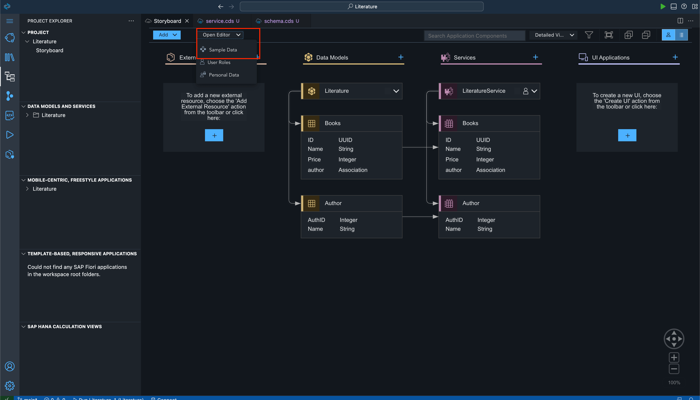

Now click on 'Add' and you will see a dialog asking you which service you want to add data for. Select 'Author' first.

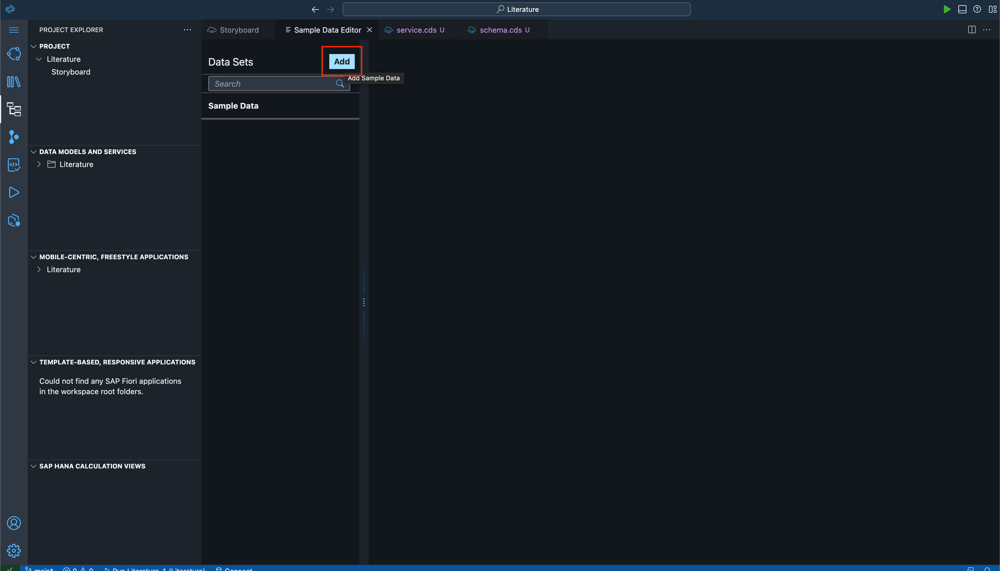

Now you will see a blank screen. Beside the 'Mock Data' type 3 and click on 'Add'.

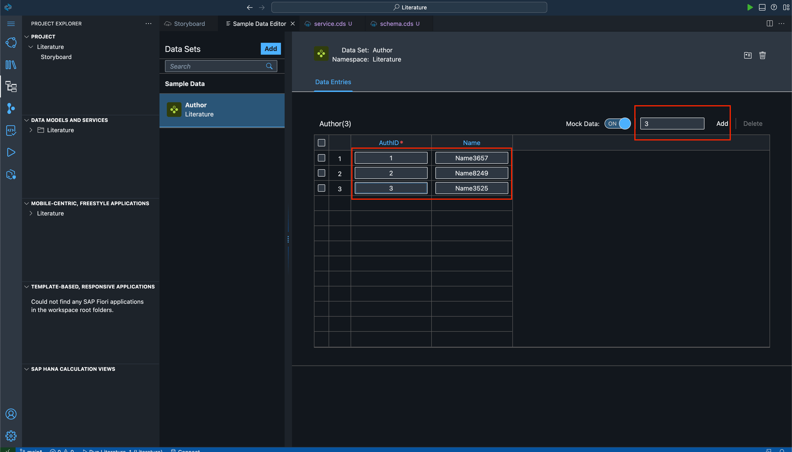

Here you can copy the below screenshots data or use your own data as you see fit. 

Now click on 'Add' again and select 'Books'. 

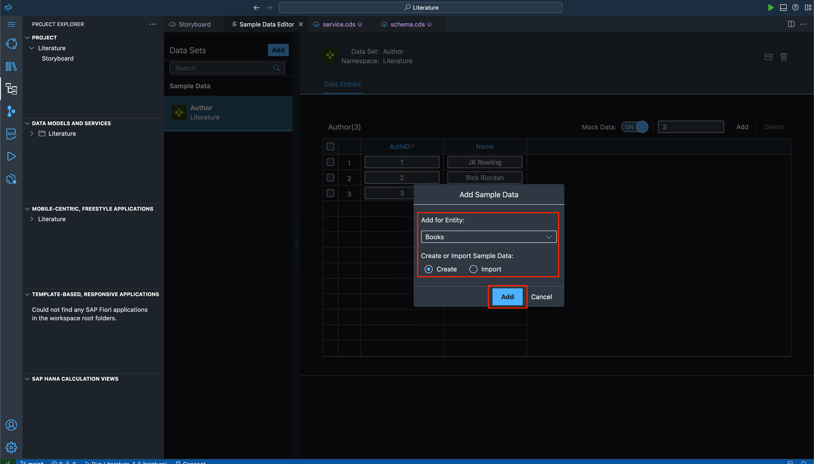

This time write '2' and add data for 2 rows.

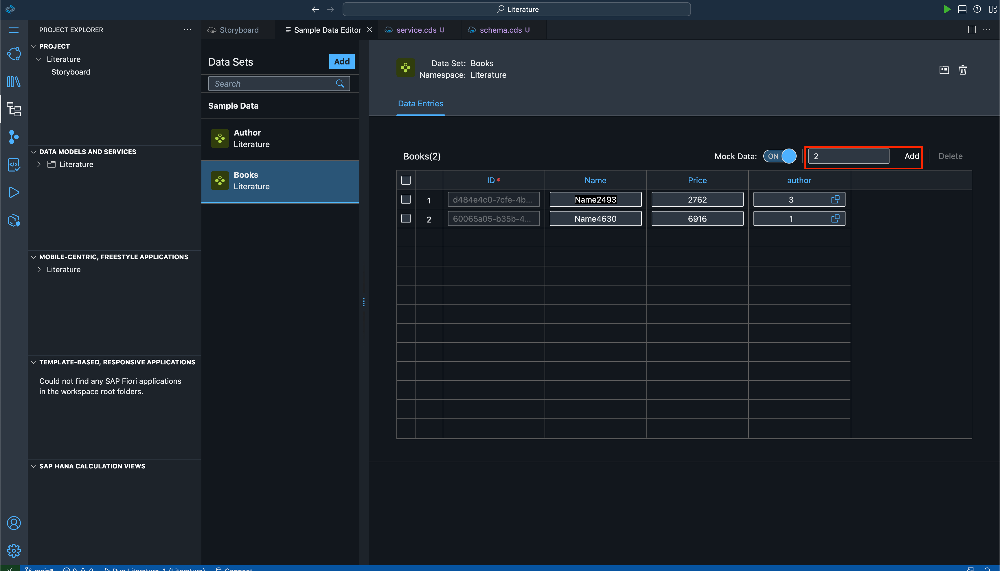

You can copy the data as shown in the screenshot below. You can also add your own data.

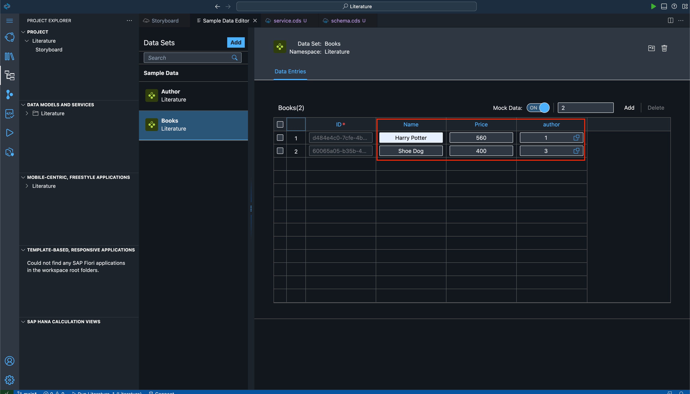

Now you can go back to the Storyboard.

Here we have basically defined a service where our previously defined entities have been projected.

### View Service

Click on the green 'Play' Button on the top right corner. This will start your application locally and you can view what you have built till now.

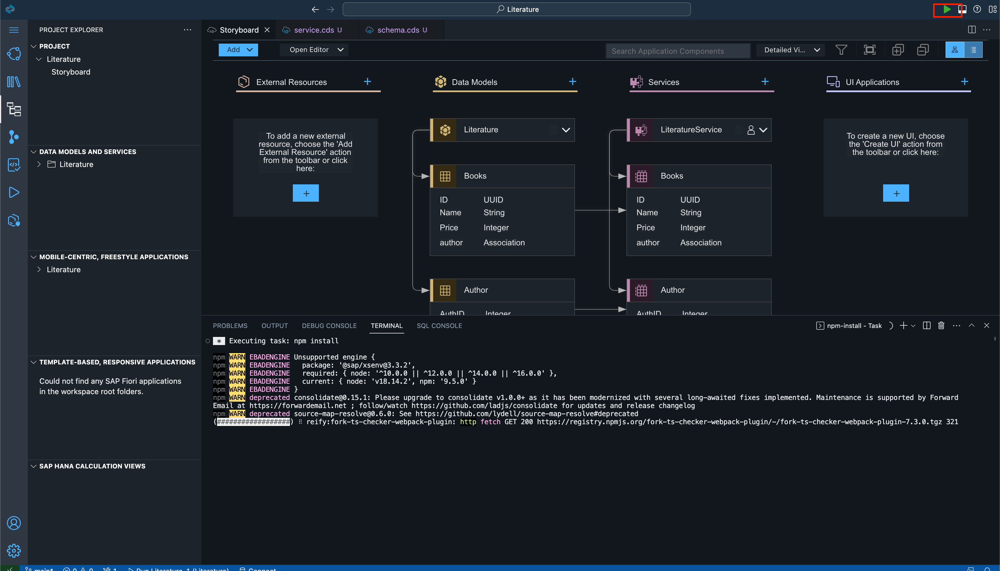

This page will open up. Click on the 'service details' link to view your service details. 

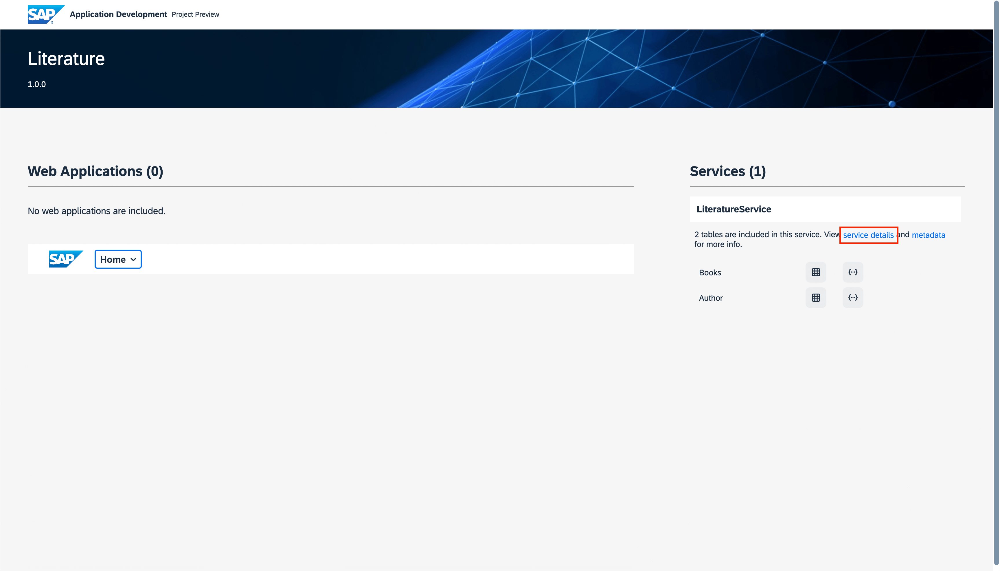

As you can see we have the 2 entities we had defined in this metadata.

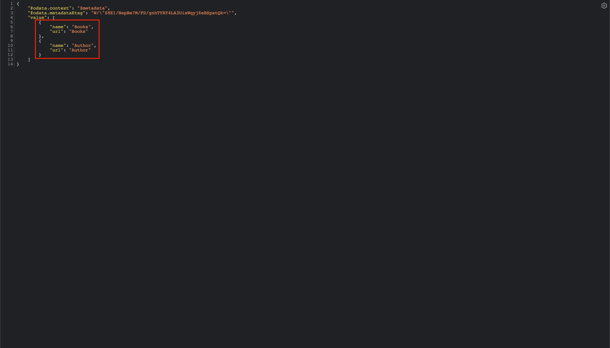

You can click on the red 'stop' button to stop the application.

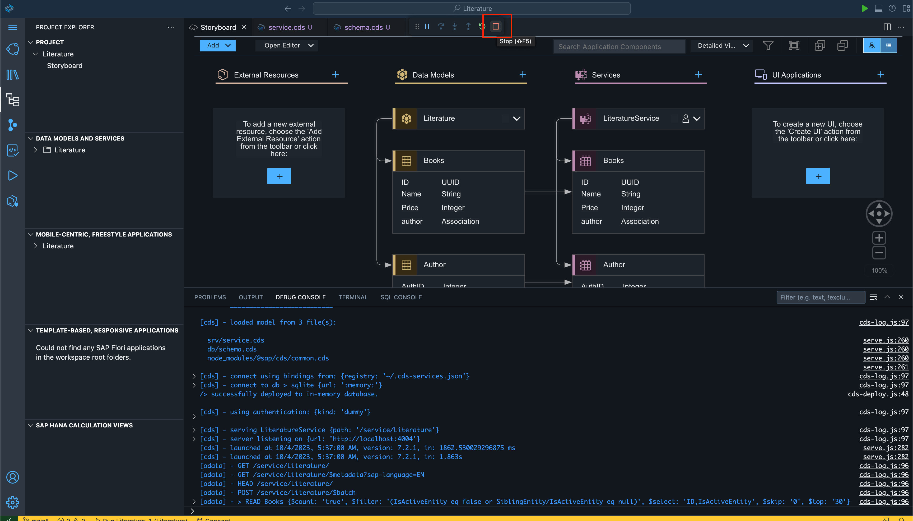

## Summary

You have now created your CAP Application by defining the Entities and the Service. We can now create the UI in the next steps.

Continue to - [Exercise 4 - Create UI to make application full stack](../ex4/README.md)