# Exercise 4 - Create UI to make application full stack
## Create UI

### Build the UI
We will now create the UI for this application and make the application full-stack.

You will be able to see the Storyboard Page. Click on the '+' symbol on the 'UI Applications' Card in order to create the UI.

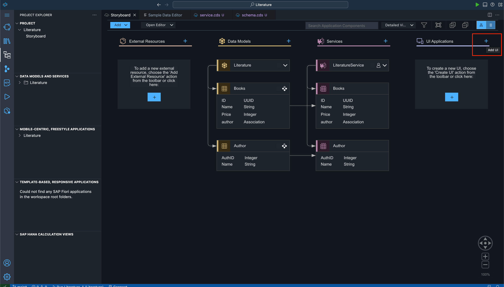

Change 'Display Name' to 'Library'. Click 'Next'.

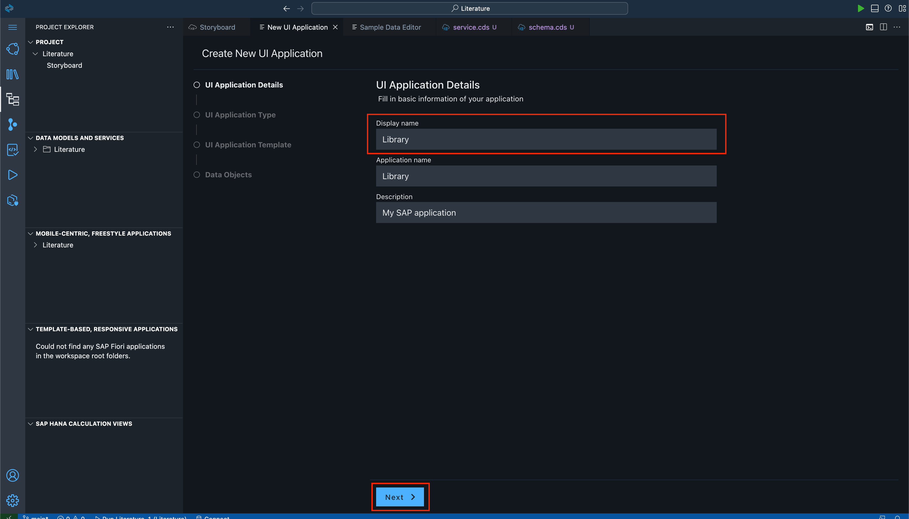

Click on 'Template-Based, Responsive Application' and click 'Next'.

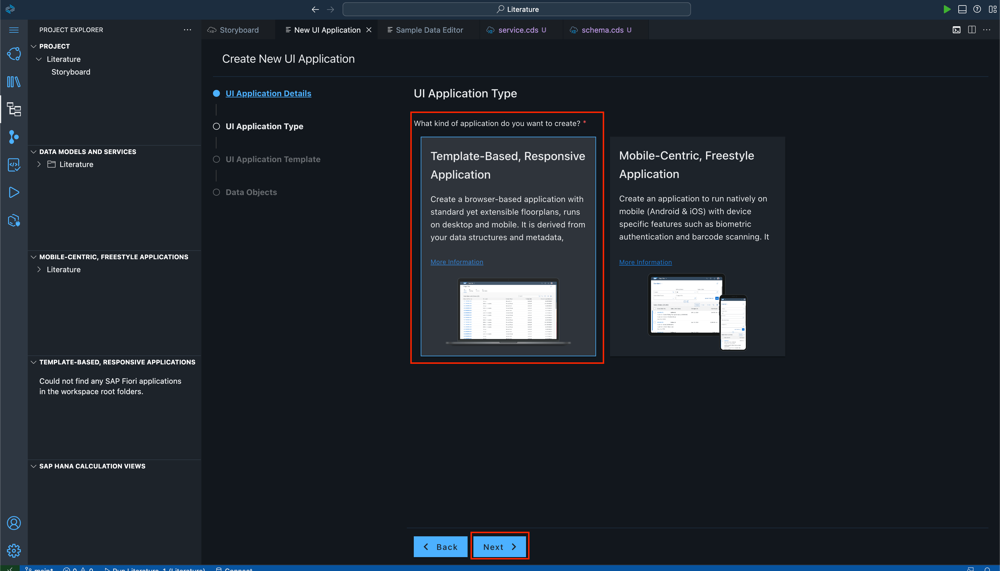

Click the 'List Report Page' and select 'Next'.

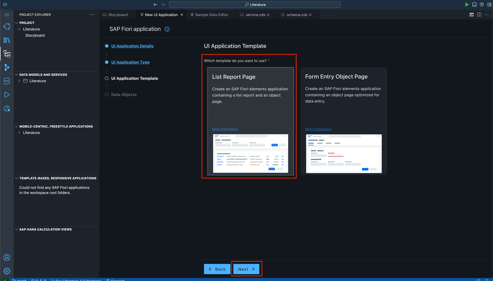

Click 'Finish'. Don't make any changes here.

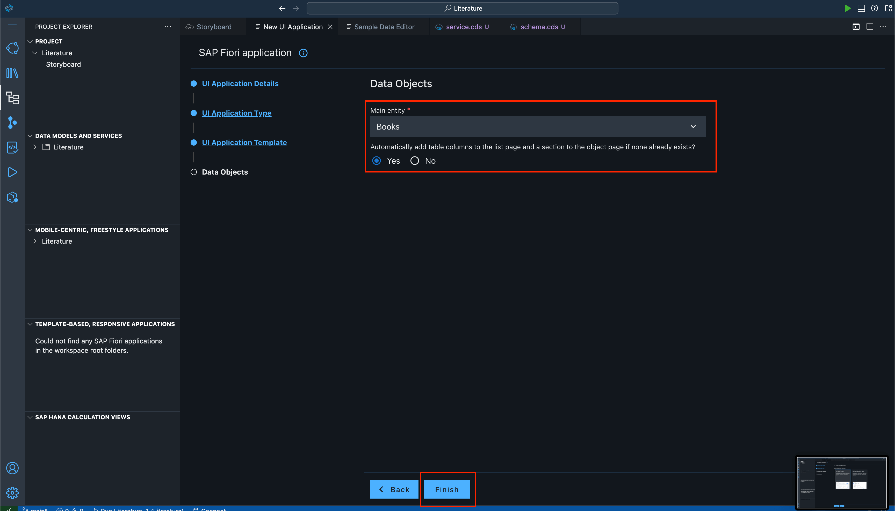

Now wait for some time while the Generator creates the UI for you. You will see 'Installing Dependencies' on the bottom right corner of your screen. Wait till it's done and the 'Page Map' automatically opens. 

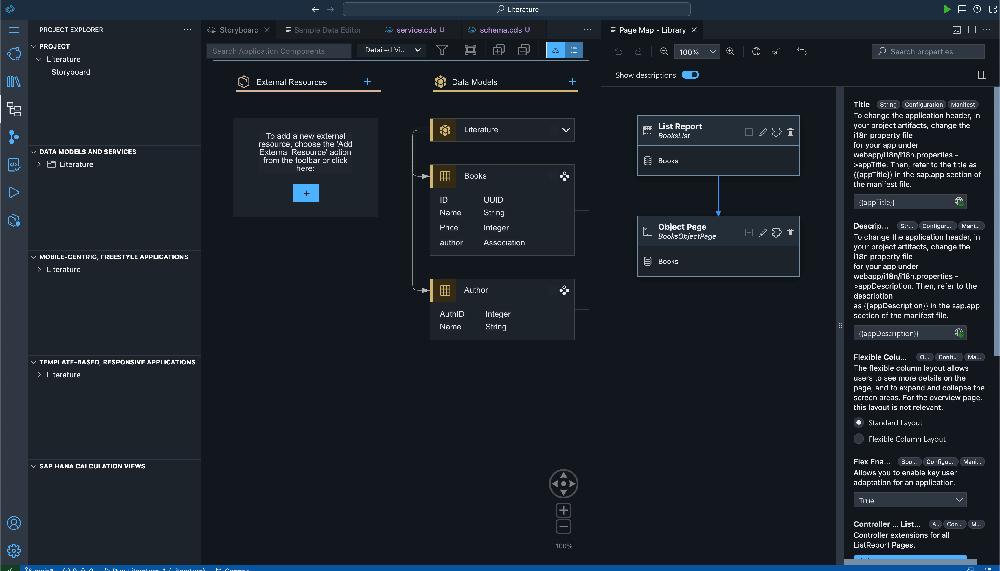

Click on the 'Configure Page' pencil icon for the 'List Report'. It will open a side page with its properties.

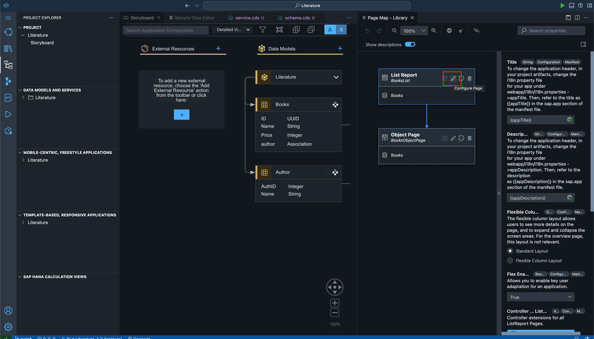

Click on 'Table' and select 'Enabled' from the options for the 'Initial Load' property. This property is useful for loading the data when the page is loaded. Otherwise you will have to keep clicking the 'Go' button every time the page loads to see the data.

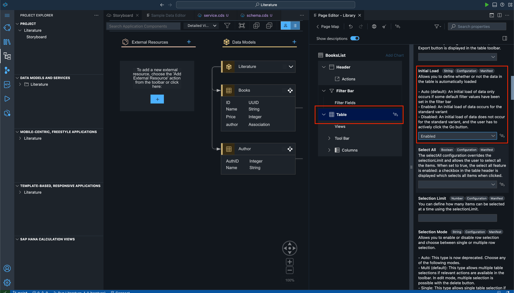

Click on 'Columns' and select 'author_AuthID'. Select 'Display Type'. Change the option to 'Value Help' for this property. We select this so we can select the option from a dropdown in the UI instead of having to type it.

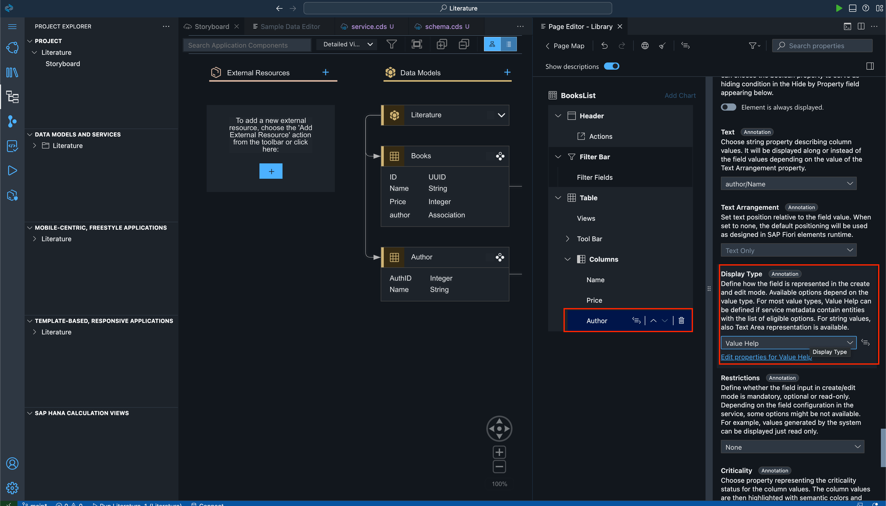

A dialog will open up. Here in the 'Label' type 'Author', and select 'Apply'.

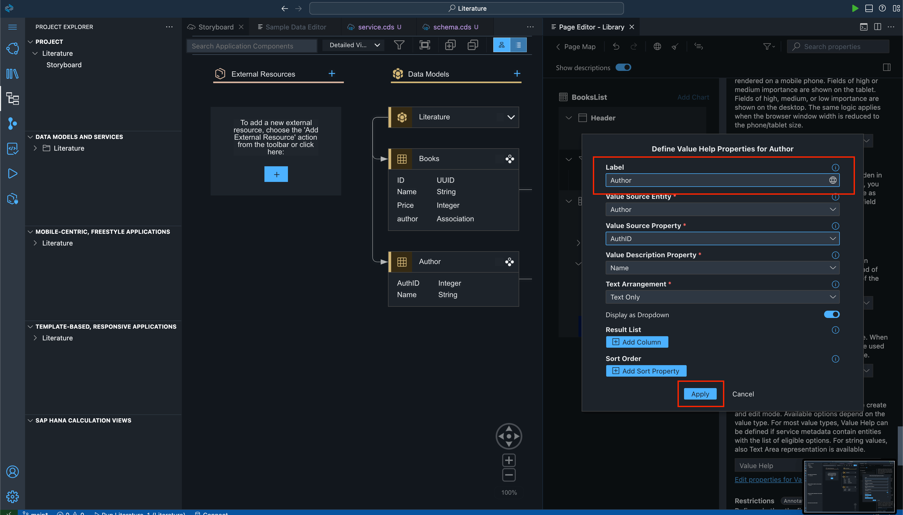

Change the 'Label' to 'Author'. Now change the 'Text' to 'author/Name' and the 'Text Arrangement' to 'Text Only'.

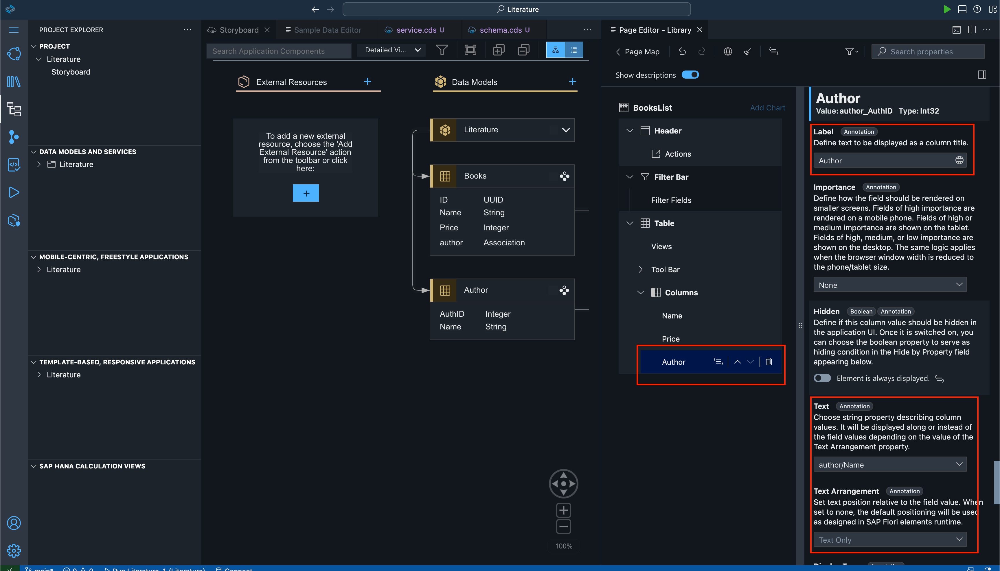

Now go back and click on the 'Object Page' 'Configure Page' icon to change its properties.

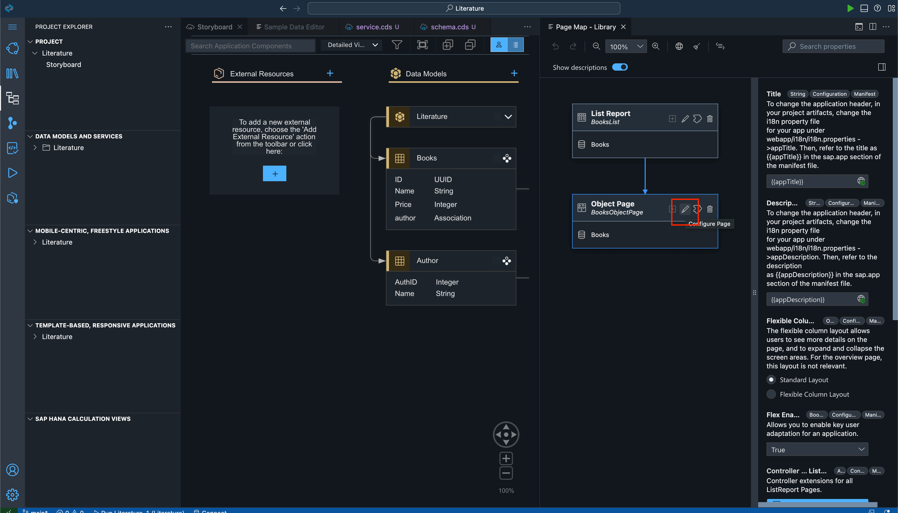

Click on 'Header' and change the 'Title' to 'Name'.

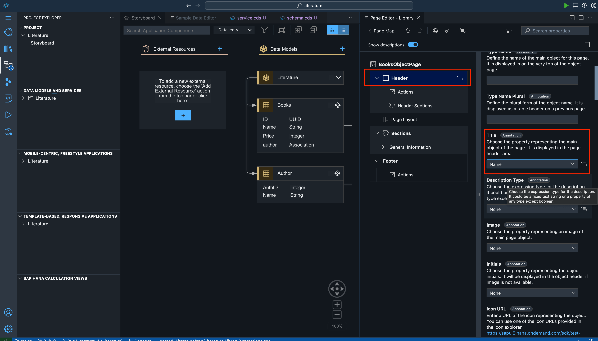

Expand 'General Information'->'Form'->'Fields'. Now select 'Label' and change it to 'Author'.

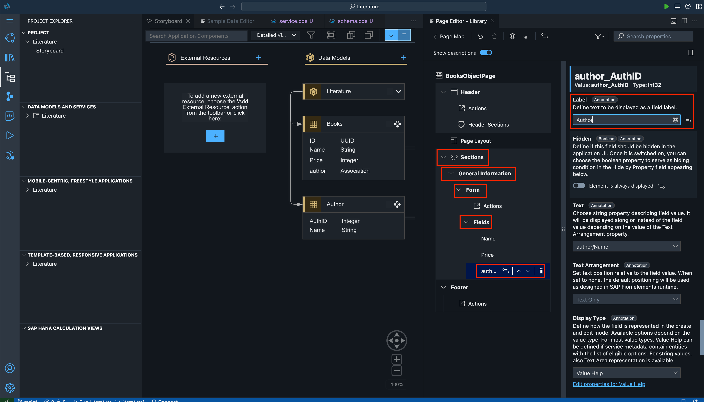

### Test Your Application

Now we will see what the UI looks like locally. Click the green 'Play' button to see the changes. It will open the terminal and run some commands. Wait for some time. It will open a page automatically.

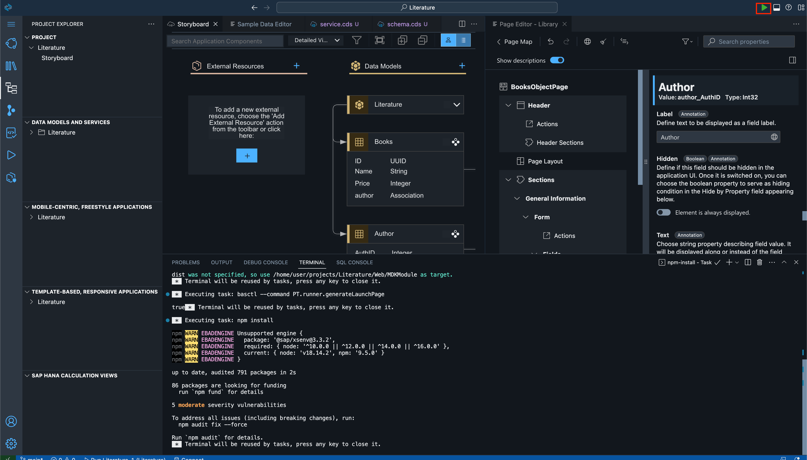

You will see this screen. Click on 'Library'.

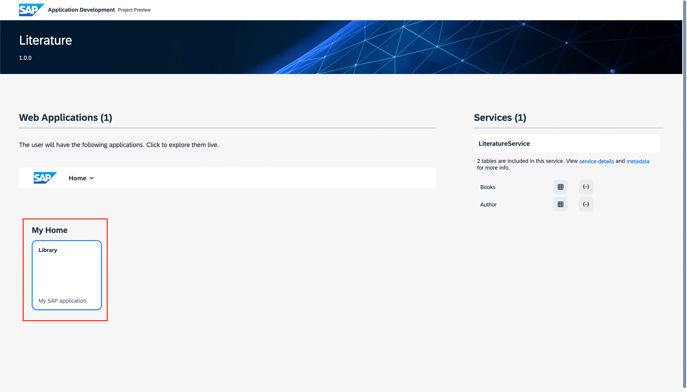

This will open the Home page where you can see the data you had previously added as 'Sample Data'. You can even click on 'Create' to create your own data. You can experiment with the app as you wish.

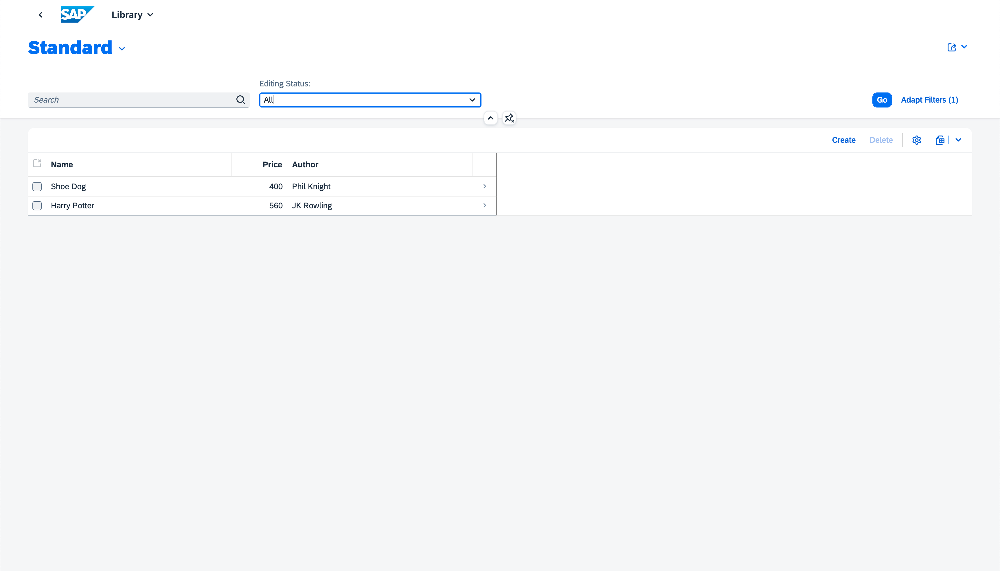

You can click on any of the rows to see the data within. You can even 'Edit' data here and experiment.

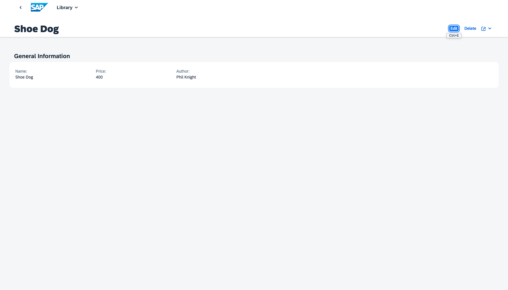

## Summary

You have now created your UI. In the next exercise we will convert this app to a SaaS app and deploy it.

Continue to - [Exercise 5 - Enable SaaS and Deploy the Project](../ex5/README.md)