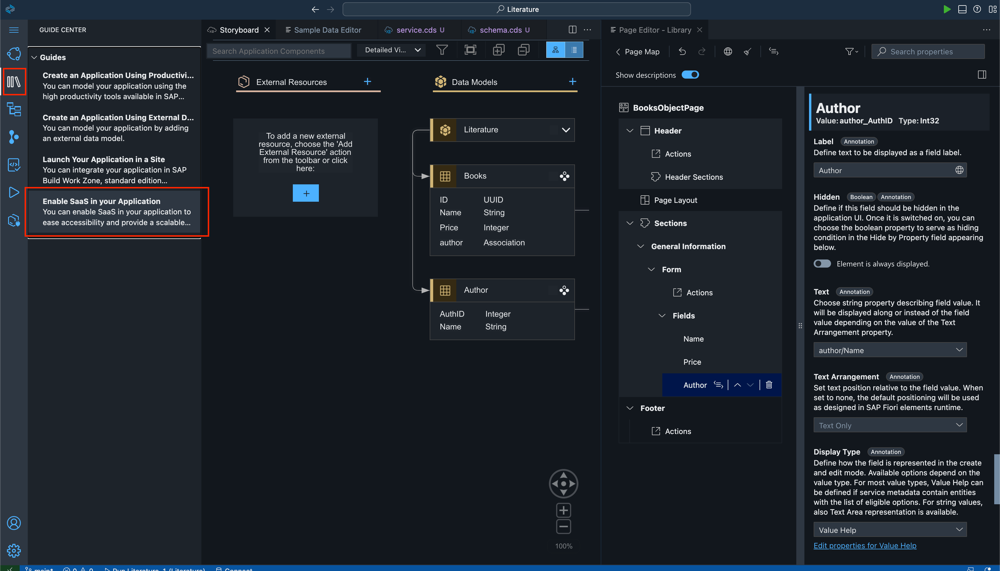
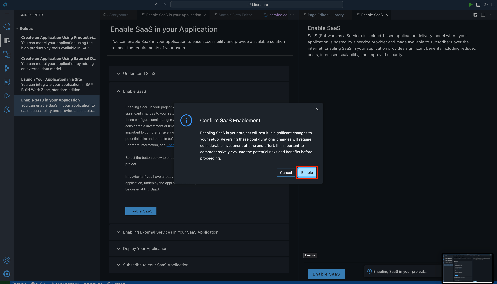
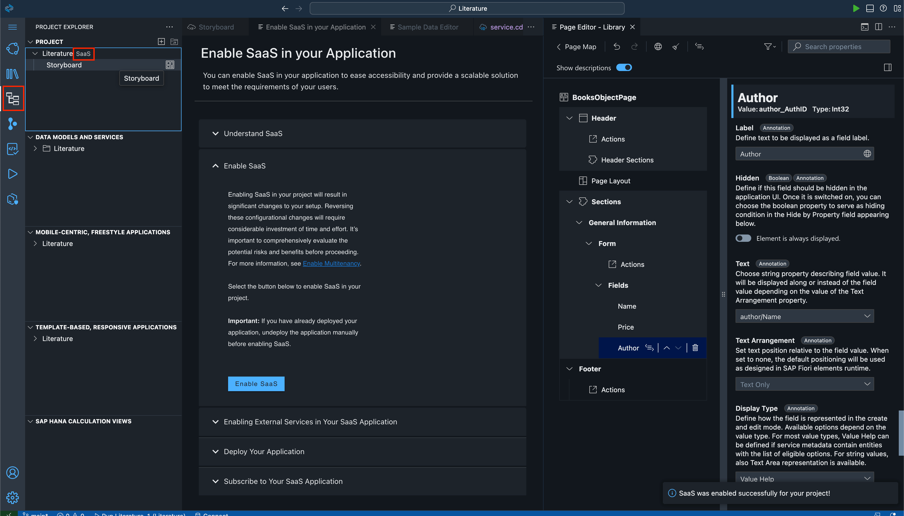
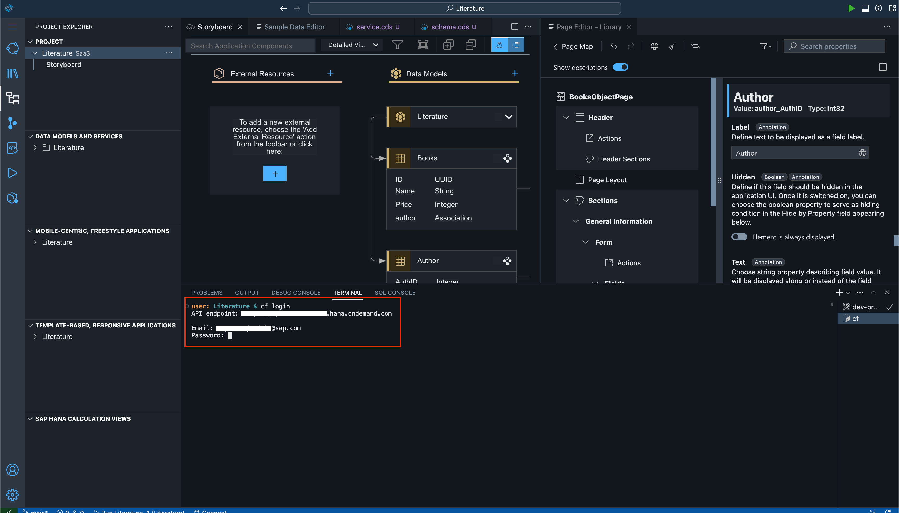
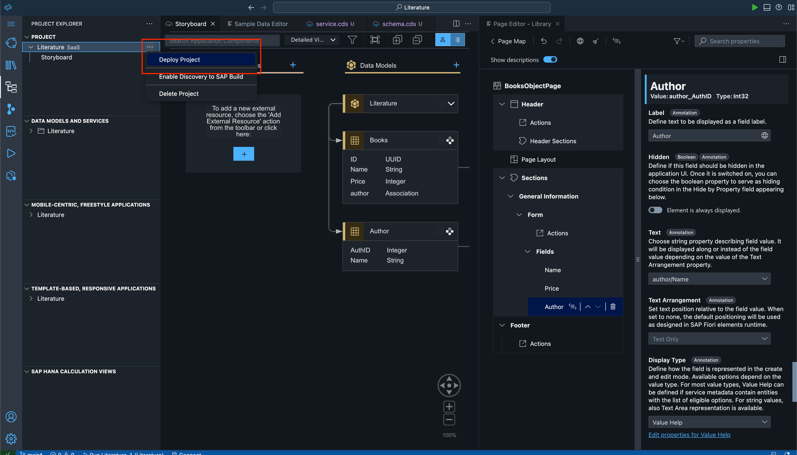
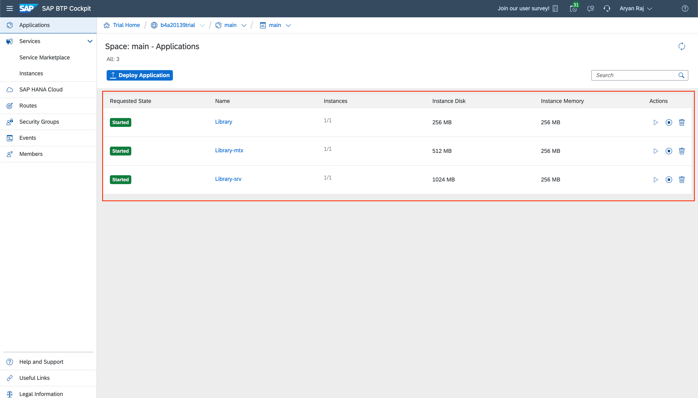

# Exercise 5 - Enable SaaS and Deploy the Project
## Enable SaaS

### Make Application Multitenant
We will now make our application multitenant.

In order to make our application multitenant we need to click on the 'Guide Center' icon shown in the below Screenshot. Expand the options once on that page. Click 'Enable SaaS in your Application'.

Expand 'Enable SaaS' option. Click on 'Enable SaaS' button.

Another page will open with more information on SaaS. Click 'Enable SaaS' there too. 

A dialog will open up. Click 'Enable SaaS' again. Keep in mind that enabling SaaS here is an irreversible change.

Now when you click on the 'Project Explorer' icon, it will show 'SaaS' beside your app name.

### Deploy App

Make sure to remember to have HANA Cloud running in your Cloud Foundry before starting the deployment.

Now type 'cf login' in the terminal and put your API Endpoint and username and password to login to Cloud Foundry so that you can deploy your app.

Click on the 3 dots to the right of the Project and click 'Deploy Project'. It will start the deployment process by first building the application and then deploying it.

### Check the deployed app in BTP Cockpit

After the process has completed in the terminal, you can check the deployment by going to your BTP account. Navigate to the space you had deployed the app in. You will be able to see your application in the 'Applications' tab.

## Summary

You have now deployed your app as a multitenant app. We will now make some configurations and subscribe to the app as a tenant.

Continue to - [Exercise 6 - Subscribe to your Multitenant App](../ex6/README.md)