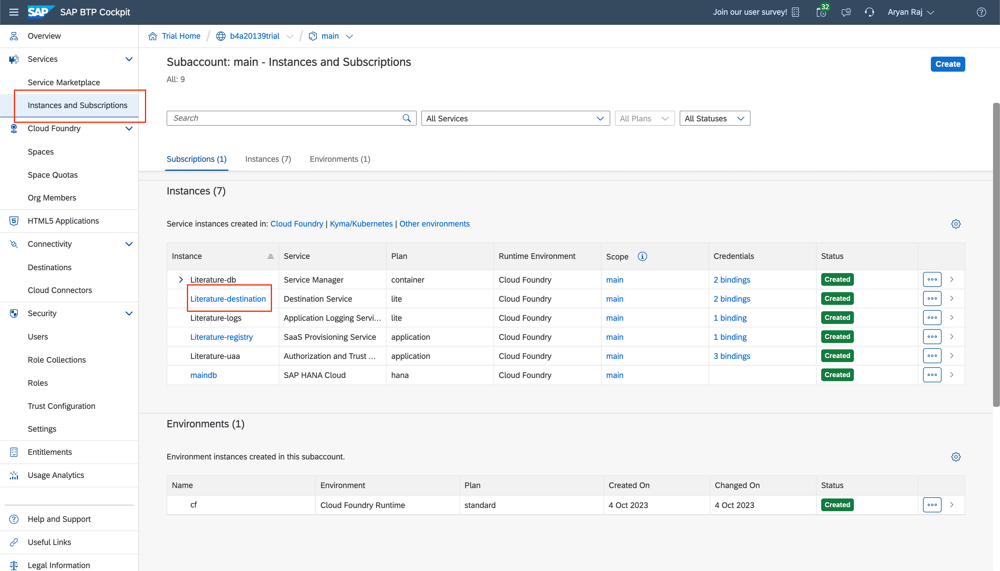
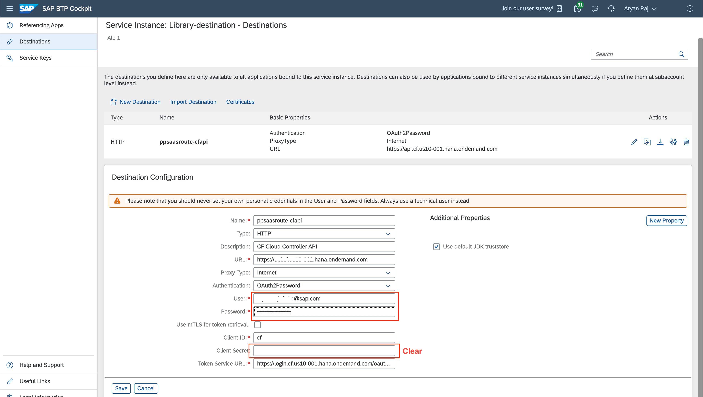
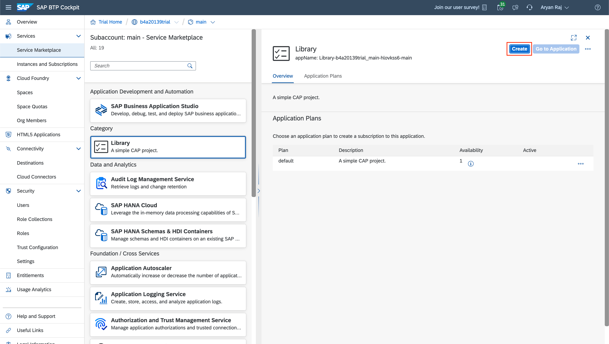
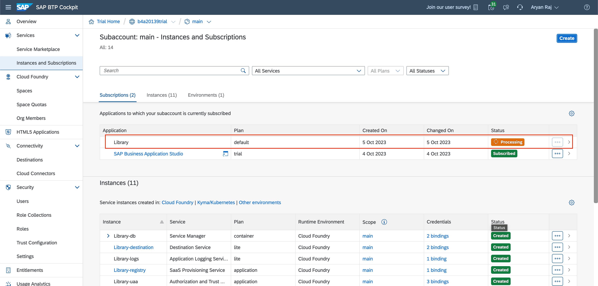
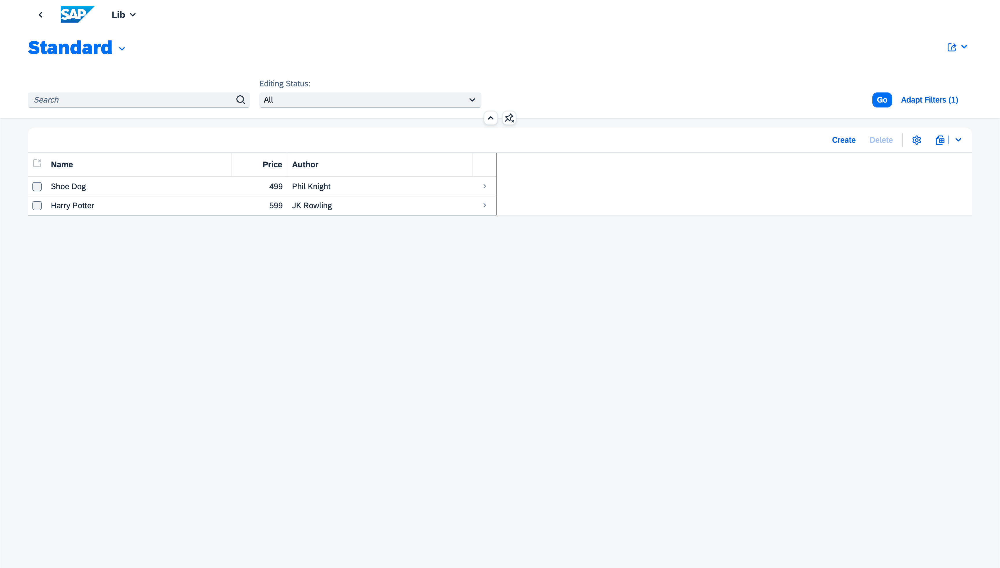

# Exercise 6 - Subscribe to your Multitenant App
## Configure App

### Configure Destination Settings
We will now make some changes to the app settings so that our tenants are able to access the app.

Go to your main Subaccount Page and click on the 'Instances and Subscriptions' tab. Here you will be able to see all your instances created for your app. Click on 'Literature-destination'.

A new page will open. Click on 'Destinations' tab. Click on the pencil icon to edit the destination settings.

Add your Username and Password for Cloud Foundry. Make sure to keep the 'Client Secret' clear without any data in it. Click 'Save'.

### Subscribe to Application

<RAJA -> In multitenancy, there is a concept of provider accounts and subscriber account. 
provider account --> where app is deployed
subscriber account --> from where we subscribe the app

So far, we have deployed and configure the app in a subacount, let scall that provider subaccount.
Now, you need another subaccount in the same GA. Let's call it subscriber account.>

There are 2 BTP subaccounts involved here. 

Now go back to the main page of your Subaccount in BTP and click on 'Service Marketplace'.

Click on your app name in the 'Service Marketplace' and click 'Create'.

A popup will open. Click 'Create' again.

Click 'View Subscription'

You will see your app will be processing.

Then it will get created. You can now click the 'Go to Application' button to open the app.

Click on the tile under 'My Home' to view your app.

You will be able to see your app running and the pages loading properly.

## Summary

You have now subscribed to your multitenant app. Congrats!!
